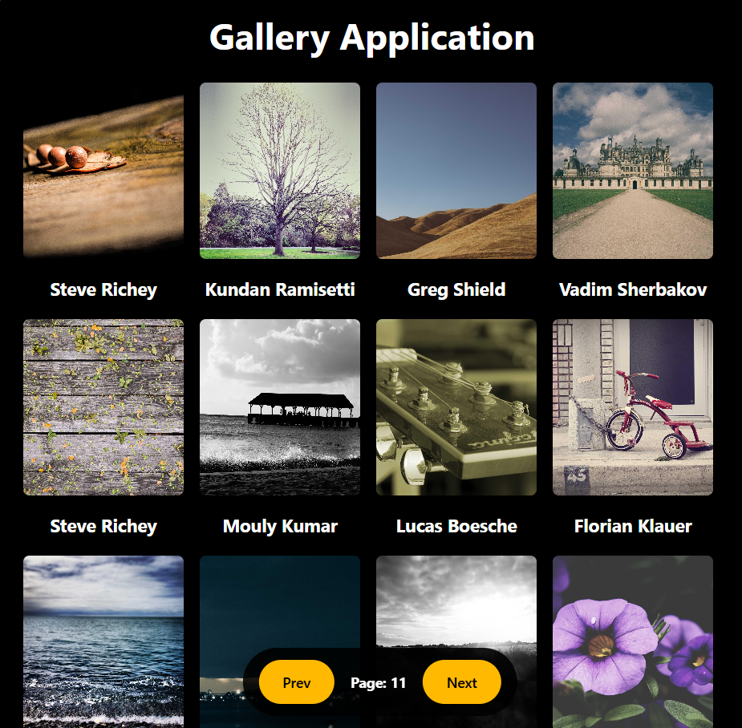
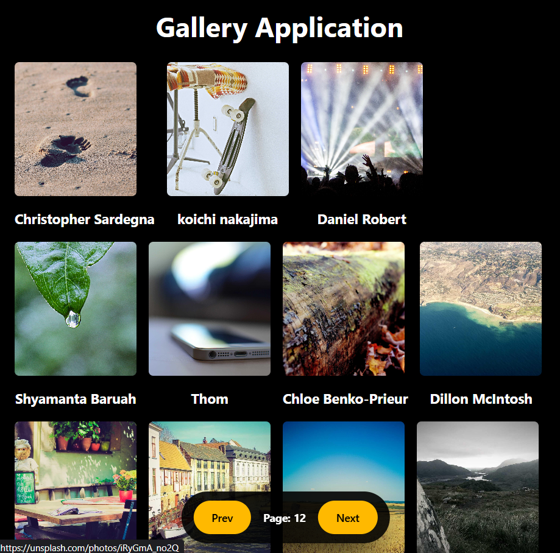

# React Gallery App

A polished photo gallery built with React, Vite, Tailwind CSS, and Axios. This project displays fully responsive image cards fetched from the Picsum Photos API and includes controlled pagination for easy browsing.



## Project overview

This gallery app is designed to showcase a modern React project with:

- A clean responsive card grid
- Data fetched from the Picsum Photos API
- Prev / Next pagination buttons with fixed bottom controls
- Clickable image cards that open full-size photo sources
- Styled layout using Tailwind CSS and utility classes

## Features

- Responsive grid layout for image cards
- Dynamic API fetching with Axios
- Reusable React component structure
- Bottom navigation controls that stay visible
- Hover effects and smooth transitions
- Easy Vite development and build setup

## Technologies used

- React
- Vite
- Tailwind CSS
- Axios
- ESLint

## Installation

```bash
npm install
```

## Run locally

```bash
npm run dev
```

Open the URL shown in the terminal to preview the gallery.

## Build

```bash
npm run build
```

## Screenshots

The screenshot section below is ready for your attached preview images. Add the actual screenshot files to `public/screenshots/` and keep the file names in README as shown.




## GitHub upload

1. Create a GitHub repository named `React-Gallery-App`.
2. From your project folder, run:

```bash
git init
git add .
git commit -m "Initial commit"
git branch -M main
git remote add origin https://github.com/Ranjan-0007/React-Gallery-App.git
git push -u origin main
```

3. If your repo already exists remotely, run:

```bash
git add .
git commit -m "Update README and gallery preview"
git push
```

## Helpful notes

- The preview image shown above is stored at `public/readme-sample.svg`.
- Place photo screenshot files in `public/screenshots/` for README preview.
- The app uses Tailwind CSS for styling and Axios to load images from Picsum.

