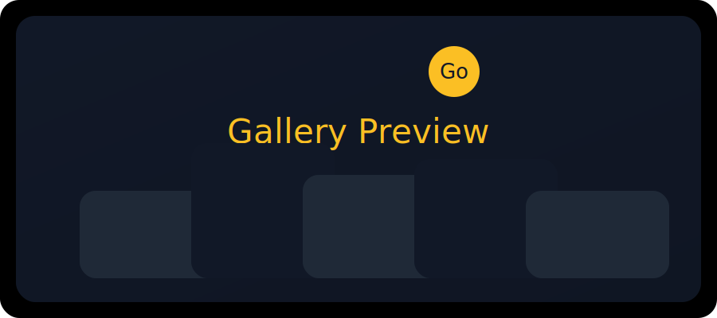

# React Gallery App

A modern photo gallery built with React, Vite, Tailwind CSS, and Axios. This app fetches images from the Picsum Photos API and displays them as responsive cards with pagination controls.



## Project summary

This gallery application demonstrates how to build a clean, responsive image browser using:

- React for component-based UI
- Vite for fast development and build performance
- Tailwind CSS for utility-first styling
- Axios to fetch data from an external API

## Features

- Responsive grid gallery layout
- Fetches images from the Picsum Photos API
- Prev / Next pagination controls
- Clickable cards that open image sources in a new tab
- Fixed bottom navigation controls
- Lightweight Tailwind styling with clean spacing and hover effects
- Component-based structure for easier reuse and maintenance

## Tech stack

- React
- Vite
- Tailwind CSS
- Axios
- ESLint

## Installation

```bash
npm install
```

## Running locally

```bash
npm run dev
```

Open the URL shown in the terminal to view the gallery.

## Build for production

```bash
npm run build
```

## GitHub repo setup

Use the following commands to publish this project to GitHub:

```bash
git init
git add .
git commit -m "Initial commit"
git branch -M main
git remote add origin https://github.com/<your-username>/react-gallery-app.git
git push -u origin main
```

If your repository already exists remotely:

```bash
git add .
git commit -m "Update README and gallery app"
git push
```

## Suggested repository details

- **Repository name:** `react-gallery-app`
- **Description:** `A React + Vite photo gallery that fetches images from Picsum, displays responsive cards, and supports pagination.`

## Notes

- The sample preview image shown above is included at `public/readme-sample.svg`.
- The gallery app is designed to be easy to extend with additional API filters, image detail pages, or search functionality.
- Tailwind CSS and Vite make this app simple to style and deploy.
